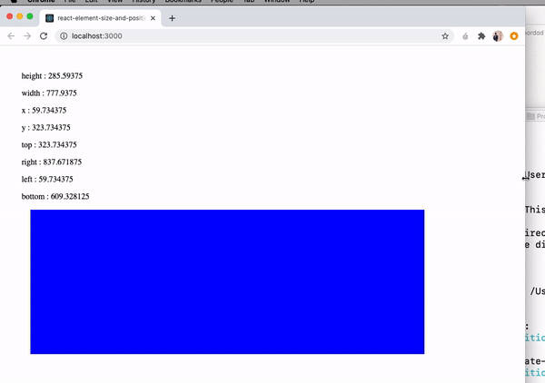

# react-element-size-and-position

> get elements and components size and position with react custome hook

[](https://www.npmjs.com/package/react-element-size-and-position) [](https://standardjs.com)

## Install

```bash
npm install --save react-element-size-and-position
```

<div align="center">
    
</div>

## Usage

```jsx
import React from 'react'

import { useElementProperties } from 'react-element-size-and-position'

const App = () => {
  let elementProperties = useElementProperties('alithecodeguy')
  return (
    <div
      style={{
        height: '50vh',
        width: '80%',
        padding: '2vw',
        margin: 14
        // backgroundColor: 'red'
      }}
    >
      {elementProperties && <p>height : {elementProperties.height}</p>}
      {elementProperties && <p>width : {elementProperties.width}</p>}
      {elementProperties && <p>x : {elementProperties.x}</p>}
      {elementProperties && <p>y : {elementProperties.y}</p>}
      {elementProperties && <p>top : {elementProperties.top}</p>}
      {elementProperties && <p>right : {elementProperties.right}</p>}
      {elementProperties && <p>left : {elementProperties.left}</p>}
      {elementProperties && <p>bottom : {elementProperties.bottom}</p>}

      <div
        id='alithecodeguy'
        style={{
          height: '20vh',
          width: '83%',
          padding: 50,
          margin: 17,
          backgroundColor: 'blue'
        }}
      ></div>
    </div>
  )
}

export default App
```

## License

MIT © [alithecodeguy](https://github.com/alithecodeguy)
